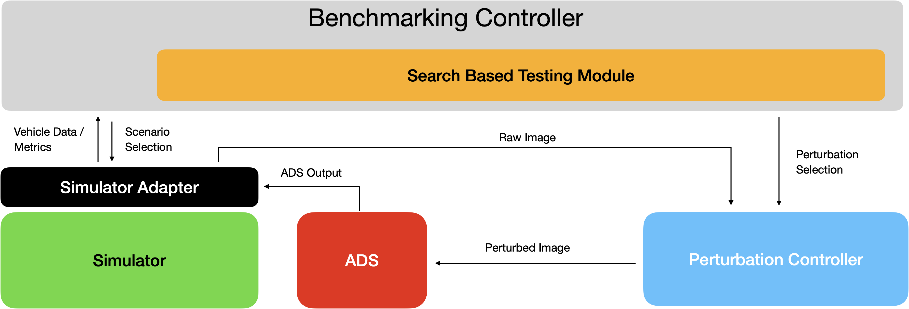

# Perturbation Drive

A library to test the robustness and ability to generalize to unseen roads of Self-Driving-Cars via image perturbations and road generators.

This library is split up into three sections:

1) A collection of the most common perturbation functions which can be used by itself.
2) A benchmarking controller to benchmark the robustness of models to common image perturbations. This controller can be used for end-to-end tests and offline testing.
3) Modular simulator integration. New simulators can be integrated by implementing a predefined interface and this project shows the example integration of the [Self Driving Sandbox Donkey](https://docs.donkeycar.com/guide/deep_learning/simulator/) (here often referred as SDSandbox) and [Udacity](https://github.com/udacity/self-driving-car-sim) Simulator. Note, that the simualtors used in this project have been adapted minimally to suits the scope of this project.



## Installation

You can install the library via the instructions detailed in section [Installing locally](#installing-locally).

After installing this library you can use all perturbationdrive classes and functions via top level imports. See this examples for the usage.

```Python
from perturbationdrive import (
    PerturbationDrive,
    RandomRoadGenerator,
    PerturbationSimulator,
    ADS,
    Scenario,
    ScenarioOutcome,
    ImageCallBack,
    ImagePerturbation,
    GlobalLog as Gl,
)
```

Please note, that all imports from the `examples` directory need to be resolved via their full path.

```Python
from examples.udacity.udacity_simulator import UdacitySimulator
```

## Project Structure

The projct has the following structure. Please note that this only provides a high level overview and does not detail all files and scripts.

```bash
perturbationdrive/
│
├── perturbationdrive/                  # All scripts related to running perturbations
│   ├── AutomatedDrivingSystem/         # Contains all script regarding the ADS interface
│   │   └── ADS.py                      # Abstract Class of the driving system
│   │
│   ├── Generative/                     # Contains all script regarding cycle gan perturbations
│   │   ├── Sim2RealGan.py              # Implementation of a CycleGAN from Donkey Sim to Real World
│   │   └── TrainCycleGan.py            # Script to train a CycleGAN given a dataset
│   │
│   ├── kernels/                        # Util scripts regarding image kernels
│   │
│   ├── NeuralStyleTransfer/            # Implementation of the fast style transfer models
│   │
│   ├── OverlayImages/                  # Util Folder containing all images used for perturbations
│   │
│   ├── OverlayMasks/                   # Util Folder containing all videos for dynamic masks
│   │
│   ├── RoadGenerator/                  # Contains all script regarding road generation
│   │   ├── RoadGenerator.py            # Abstract base class of the road generator
│   │   ├── RandomRoadGenerator.py      # Generates a random road
│   │   └── CustomRoadGenerator.py      # Generates a raod given angles and segment lengths between waypoints
│   │
│   ├── SaliencyMap/                    # Contains all scripts regarding attention map generation
│   │
│   ├── Simulator/                      # Contains all script regarding simualtors and scenarios
│   │   ├── Simualtor.py                # Abstract base class of the simulator
│   │   ├── Scenario.py                 # Data-Classes for Scenarios and Scenario Outcomes
│   │   └── image_callback.py           # Provides functionality to view images in a second monitor
│   │
│   ├── utils/                          # Contains all util scripts of the library
│   │
│   ├── README.md                       # Further Documentation on the perturbations library
│   ├── imageperturbations.py           # Perturbation Controller
│   ├── perturbationdrive.py            # Benchmarking Controller
│   └── perturbationsfuncs.py           # Collection of image perturbations
│
├── examples /                          # Provides examples on simualtor integrations
│   ├── test_dir/                       # Empty folder. Use this folder for own scripts and experimenting with this project. All files within this folder will be untracked.
│   ├── models/                         # Example implenetation of the ADS class
│   │   ├── README.md                   # Documentation and Explanation on the example
│   │   └── example_agent.py            # Example subclass of the ADS
│   │
│   ├── open_sbt/                       # Documentation and Examples of OpenSBT integration
│   │   └── README.md                   # Documentation and Explanation on the example
│   │
│   ├── self_driving_sandbox_donkey/        # Example integration of Self Driving Sandbox Donkey Sim
│   │   ├── README.md                   # Documentation and Explanation on the SDSandbox Simualtor
│   │   ├── sdsandbox_simulator.py      # Simulator class implementation for the SDSandbox Donkey Sim 
│   │   └── main.py                     # Entry point to run the example
│   │
│   └── udacity/                        # Example integration of Udacity Sim
│       ├── README.md                   # Documentation and Explanation on the Udacity Simualtor
│       ├── udacity_simulator.py        # Simulator class implementation for the Udacity Simulator
│       └── main.py                     # Entry point to run the example
│
├── README.md                           # The top level ReadME of the project (this file)
└── requirements.txt                    # Requirements for running this project
```

## Performing Image Perturbations

Apply common image perturbations and corruptions to images. Note, that each method expects an image with 3 color channels and the dtype `uint8`.
Each perturbation needs an input image and the scale of the perturbation as input. The scale is in the range from 0 to 4.

```Python
from perturbationdrive import poisson_noise
import numpy as np

height, width = 300, 300
random_image = np.random.randint(0, 256, (height, width, 3), dtype=np.uint8)
perturbed_image = poisson_noise(0, random_image)
```

Read the README in the `perturbationdrive/` directory for more details on performing standalone image perturbations.

## Benchmarking Self-Driving Cars

The benchmarking is performed by the `PerturbationDrive` class. This class can perform either offline evaluation of a dataset, perform gird search over the entire search space or simulate a list of specific scenarions.

A benchmarking object can be created by instanciating a new `PerturbationDrive` object. Each object needs to be constructed with the simulator under test and the system under test. The system under test is an `Autonomous Driving System (ADS)`. Note that this example snippet is minimal and does not provide a full example. For full examples refer to the [Simulator Integration Section](#simulator-integration).

```Python
# setup demo objects
simulator = ExampleSimulator()
ads = ExampleADS()

# create a new perturbation controller
benchmarking_object = PerturbationDrive(simulator=simulator, ads=ads)

# perform grid search as end to end test
benchmarking_object.grid_seach()

# simulate scenarios as end to end test
benchmarking_obj.simulate_scenarios(scenarios=getDemoScenarios())

# perform model based testing on a dataset
benchmarking_obj.offline_perturbation(dataset_path="./dataset/")
```

Read the README in the `perturbationdrive/` directory for more documentation on running end to end or model based tests based on image perturbations.

## Simulator Integration

The simulator provides an easy to use interface for running simulations with this library, with or without image perturbations. A simulator integration can be achieved by creating a subclass from the simulator and implementing all class methods. All class methods are depicted in the following class signature.

```Python
class PerturbationSimulator(ABC):
    def __init__(
        self,
        max_xte: float = 2.0,
        simulator_exe_path: str = "",
        host: str = "127.0.0.1",
        port: int = 9091,
        initial_pos: Union[Tuple[float, float, float, float], None] = None,
    ):
        # inits a new simulator object

    @abstractmethod
    def connect(self):
        # connects the class to the simulator binary

    @abstractmethod
    def simulate_scanario(
        self, agent: ADS, scenario: Scenario, perturbation_controller: ImagePerturbation
    ) -> ScenarioOutcome:
        # simulates a scenario

    @abstractmethod
    def tear_down(self):
        # tears down the connection to the simulator binary
```

Read the README in the `perturbationdrive/simulator/` directory for more documentaion on simulator integration. Also view the example integrations in `examples/self_driving_sandbox_donkey/` and `examples/udacity/`.

### Minimal SDSandbox Example

Refer to the [Interface with PerturbationDrive](https://github.com/HannesLeonhard/PerturbationDrive/tree/main/examples/self_driving_sandbox_donkey#interface-with-perturbationdrive) section within the `examples/self_driving_sandbox_donkey` directory for a minimal example of running this framework with the Self Driving Sandbox Donkey Simulator.

### Minimal Udacity Example

Refer to the [Interface with PerturbationDrive](https://github.com/HannesLeonhard/PerturbationDrive/blob/main/examples/udacity/README.md#interface-with-perturbationdrive) section within the `examples/udacity` directory for a minimal example of running this framework with the Udacity Simulator.

## Installing locally

Clone this library from [GitHub](https://github.com/HannesLeonhard/PerturbationDrive/tree/main).

* HTTPS

    ```Shell
    git clone https://github.com/HannesLeonhard/PerturbationDrive.git
    ```

* SSH

    ```Shell
    git clone git@github.com:HannesLeonhard/PerturbationDrive.git
    ```

* GitHub CLI

    ```Shell
    gh repo clone HannesLeonhard/PerturbationDrive
    ```

Create a new virtual environment using Python >= 3.6. This can be done for example via [Micromamba](https://mamba.readthedocs.io/en/latest/user_guide/micromamba.html).

1. Install Micromamba. If you currently do not have Micromamba install it and set it up locally.
2. Create a new environment

    ```Shell
    micromamba create -n myenv python=3.9
    ```

3. Activate the environment

    ```Shell
    micromamba activate myenv
    ```

4. Install all requirements

    ```Shell
    pip install -r requirements.txt
    ```

5. (Optionally) Install this library locally.

    ```Shell
    cd PerturbationDrive
    pip install .
    ```

    After local installation, the library can imported via `import perturbationdrive` within any Python script.

6. Deactivate environment after use

    ```Shell
    micromamba deactivate myenv
    ```

### Troubleshooting

Depending on your setup you might to need to exclude some libraries (i.e. `tensorflow-metal`)

## Results

This sections provides references to the empirical evaluations resulting from this framework.

* [Benchmarking Robustness In Self Driving Cars: A system-level framework](https://drive.google.com/file/d/1J5TalKyyUU8AtOZKAFU79JmZI5T_KrWO/view)
